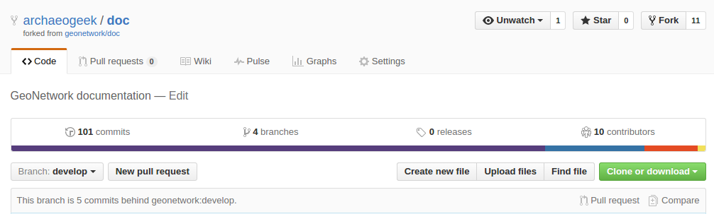

# How to sumit a pull request

To get your changes integrated into the main repository, in this case [github.com/archaeogeek/foss4gukhipsteripsem](https://github.com/archaeogeek/foss4gukhipsteripsem), you need to submit a pull request.

Your copy of the repository will contain a status line that shows how up to date your fork is with the original.

