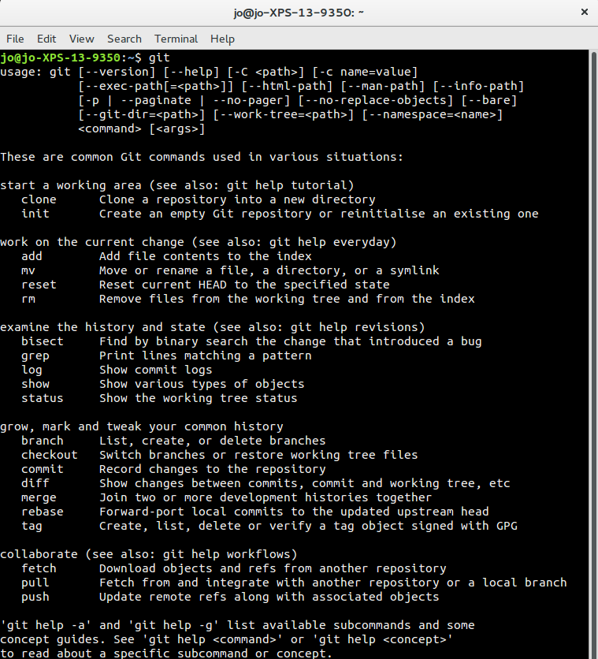

# Finding Git once it's installed

## Linux

Open a command prompt and type:

	git

## Windows

If you installed Git for Windows then in your start menu, under "Git" you will have three options:

 * Git Bash- a command prompt that emulates a linux BASH terminal, giving you access to linux commands
 * Git CMD- a modified windows command prompt
 * Git GUI- a graphic user interface for Git

For the purposes of this workshop you should use **Git Bash**.

If you installed GitHub Desktop then in your start menu, under "GitHub, Inc" you will have three options:

 * Git Shell- a powershell command prompt
 * GitHub online support- a shortcut to GitHub Desktop's online support
 * GitHub- a graphical user interface for Git

For the purposes of this workshop you should use **Git Shell**.

## Mac

If you're using Git via XCode then start up terminal and type

	git

If you installed GitHub Desktop then also start up terminal and type

	git

If this doesn't work (for example, if it prompts you to install the XCode developer tools) then close terminal, and in GitHub desktop, go to the preferences, and the advanced tab, and click the button marked "Install command line tools". You should then be able to open terminal and access the git command line as above.

# Start Git

In every case above, when you arrive at a command prompt, type:

	git

You will see an outline of the syntax plus a list of some of the most common commands, with an explanation of their usage.

